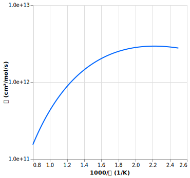
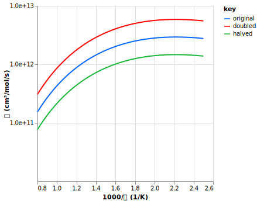
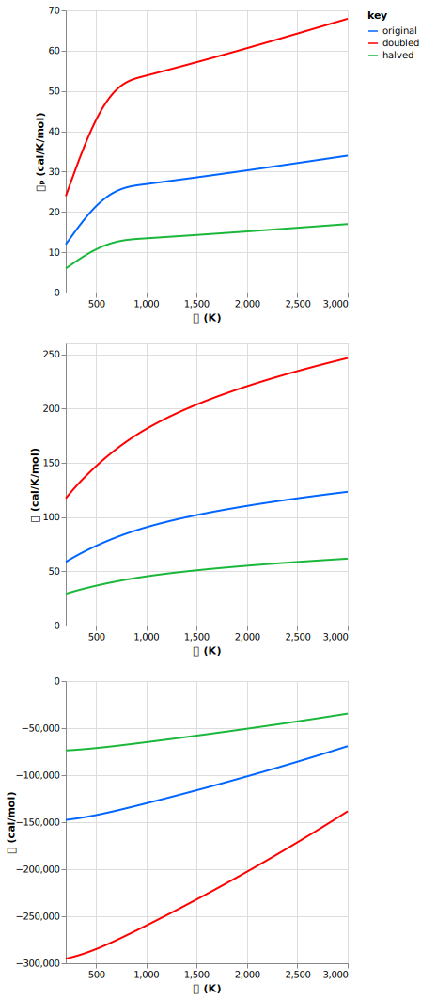

# AutoChem / AutoMol

Andreas V. Copan, Kevin B. Moore III, Sarah N. Elliott, and Stephen J. Klippenstein


## Description

This repository implements the cheminformatics routines used by the AutoMech project.
It consists of two independent modules:
 - AutoChem: A library for manipulating and interconverting kinetic and thermochemical data formats.
 - AutoMol: A library for manipulating and interconverting molecular representations.

Also included in this repository is [MolSym](molsym/README.md), an
externally-developed package for handling molecular symmetry, by Stephen M.
Goodlett and Nathaniel L. Kitzmiller (see [here](molsym/README.md) for details).


## Installation

This package can be installed from source as follows.
```
pip install .
# add -e for editable install
# use .[dev] to include developer dependencies
```

## AutoChem

This is a prototype of a planned revision of AutoMech's code for handling
kinetic and thermochemical data.

### Kinetic Data

*Data storage.*
One can generate a reaction rate object from a Chemkin string as follows.
```
import autochem as ac

rxn = ac.rate.from_chemkin_string(
    """
    C2H4+OH=PC2H4OH          2.560E+36    -7.752     6946
        PLOG /   1.000E-02   1.740E+43   -10.460     7699 /
        PLOG /   2.500E-02   3.250E+37    -8.629     5215 /
        PLOG /   1.000E-01   1.840E+35    -7.750     4909 /
        PLOG /   1.000E+00   2.560E+36    -7.752     6946 /
        PLOG /   1.000E+01   3.700E+33    -6.573     7606 /
        PLOG /   1.000E+02   1.120E+26    -4.101     5757 /
    """,
    units={"energy": "cal"},
)
rxn_dct = rxn.model_dump()
rxn_dct
# ------------------------------ [output]: ------------------------------
# {
#     "reactants": ["C2H4", "OH"],
#     "products": ["PC2H4OH"],
#     "reversible": True,
#     "rate": {
#         "order": 2,
#         "efficiencies": {},
#         "As": [1.74e43, 3.25e37, 1.84e35, 2.56e36, 3.7e33, 1.12e26],
#         "bs": [-10.46, -8.629, -7.75, -7.752, -6.573, -4.101],
#         "Es": [7699.0, 5215.0, 4909.0, 6946.0, 7606.0, 5757.0],
#         "Ps": [0.01, 0.025, 0.1, 1.0, 10.0, 100.0],
#         "type": "plog",
#     },
# }
```
This `Reaction` object is a Pydantic model that includes all of the information needed
to add this reaction rate to a kinetic mechanism for simulation.
The `rate` attribute can be either raw rate constant values, $k(T,P)$ stored in a `Rate`
object or a kinetic parametrization, stored in one of several `RateFit` subtypes.
In this case, it stores a `PlogRateFit`.
```
rxn.rate
# ------------------------------ [output]: ------------------------------
# PlogRateFit(order=2, efficiencies={}, ..., type='plog')
```

Pydantic makes serialization and deserialization very easy.
The `rxn_dct` dictionary above can be used to instantiate a new object as follows,
automatically instantiating the correct `RateFit` subtype.
```
ac.rate.Reaction.model_validate(rxn_dct)
# ------------------------------ [output]: ------------------------------
# Reaction(reactants=['C2H4', 'OH'], ..., rate=PlogRateFit(...))
```
This allows one to, for example, retrieve stored rate constant data from JSON files with
minimal hassle.

*Scalar multiplication.*
Rate objects can also be multiplied by scalars.
```
rxn_times_2 = rxn * 2
rxn_times_2.rate.model_dump()
# ------------------------------ [output]: ------------------------------
# {
#     "order": 2,
#     "efficiencies": {},
#     "As": [3.48e43, 6.5e37, 3.68e35, 5.12e36, 7.4e33, 2.24e26],
#     "bs": [-10.46, -8.629, -7.75, -7.752, -6.573, -4.101],
#     "Es": [7699.0, 5215.0, 4909.0, 6946.0, 7606.0, 5757.0],
#     "Ps": [0.01, 0.025, 0.1, 1.0, 10.0, 100.0],
#     "type": "plog",
# }
```

*Plotting.*
One can generate Arrhenius plots of rate constants using the function
`autochem.rate.display`.
```
ac.rate.display(rxn)
```


For convenience, one can also plot multiple rates against each other with a legend.
```
rxn_times_2 = rxn * 2
rxn_divided_by_2 = rxn / 2

ac.rate.display(
    rxn,
    label="original",
    others=[rxn_times_2, rxn_divided_by_2],
    others_labels=["doubled", "halved"],
)
```


*Units.* Above, we assumed that the rate constant data matches the internal units used by AutoChem, which are as follows (see `autochem.unit_.system`):
 - time: s
 - temperature: K
 - length: cm
 - substance: mol
 - pressure: atm
 - energy: cal

When this is not the case, one can specify units for each of the dimensions
listed above.
For example, the activation energies might be given in kcal.
```
import autochem as ac

rxn = ac.rate.from_chemkin_string(
    """
    C2H4+OH=PC2H4OH          2.560E+36    -7.752     6.946
        PLOG /   1.000E-02   1.740E+43   -10.460     7.699 /
        PLOG /   2.500E-02   3.250E+37    -8.629     5.215 /
        PLOG /   1.000E-01   1.840E+35    -7.750     4.909 /
        PLOG /   1.000E+00   2.560E+36    -7.752     6.946 /
        PLOG /   1.000E+01   3.700E+33    -6.573     7.606 /
        PLOG /   1.000E+02   1.120E+26    -4.101     5.757 /
    """,
    units={"energy": "kcal"},
)
rxn_dct = rxn.model_dump()
rxn_dct
# ------------------------------ [output]: ------------------------------
# <dictionary from above>
```
Under the hood, the [Pint](https://pint.readthedocs.io/) library is used for unit handling.

### Thermodynamic Data

*Data storage.*
One can generate a species thermodynamics object from a Chemkin string as follows.
```
import autochem as ac

spc = ac.therm.from_chemkin_string(
  """
  CH2O3(82)               H   2C   1O   3     G   100.000  5000.000  956.75      1
   1.18953474E+01 1.71602859E-03-1.47932622E-07 9.25919346E-11-1.38613705E-14    2
  -7.81027323E+04-3.82545468E+01 2.98116506E+00 1.14388942E-02 2.77945768E-05    3
  -4.94698411E-08 2.07998858E-11-7.51362668E+04 1.09457245E+01                   4
  """
)
spc_dct = spc.model_dump()
spc_dct
# ------------------------------ [output]: ------------------------------
# {
#     "name": "CH2O3(82)",
#     "therm": {
#         "T_min": 100.0,
#         "T_max": 5000.0,
#         "formula": {"H": 2, "C": 1, "O": 3},
#         "charge": 0,
#         "T_mid": 956.8,
#         "coeffs_low": [
#             2.98116506,
#             0.0114388942,
#             2.77945768e-05,
#             -4.94698411e-08,
#             2.07998858e-11,
#             -75136.2668,
#             10.9457245,
#         ],
#         "coeffs_high": [
#             11.8953474,
#             0.00171602859,
#             -1.47932622e-07,
#             9.25919346e-11,
#             -1.38613705e-14,
#             -78102.7323,
#             -38.2545468,
#         ],
#         "type": "nasa7",
#     },
# }
```
As for reactions above, this `Species` object is a Pydantic model that includes all of
the information needed to add this species thermodynamics to a kinetic mechanism for
simulation.
The `therm` attribute can be either raw partition function values, $\ln(Q(T))$, stored in
a `Therm` object or a thermodynamic parametrization, stored in one of several `ThermFit`
subtyptes.
In this case, it stores a `Nasa7ThermFit`.
```
spc.therm
# ------------------------------ [output]: ------------------------------
# Nasa7ThermFit(T_min=100.0, T_max=5000.0, ..., type='nasa7')
```
Again, through Pydantic it is very easy to deserialize the `spc_dct` dictionary above.
```
ac.therm.Species.model_validate(spc_dct)
# ------------------------------ [output]: ------------------------------
# Species(name='CH2O3(82)', therm=Nasa7ThermFit(...))
```

*Plotting.*
One can generate plots of thermodynamic functions using the function
`autochem.therm.display`.
By default, this plots the constant-pressure heat capacity, entropy, and enthalpy.
```
spc_times_2 = spc * 2
spc_divided_by_2 = spc / 2

ac.therm.display(
    spc,
    label="original",
    others=[spc_times_2, spc_divided_by_2],
    others_labels=["doubled", "halved"],
)
```


## AutoMol

Automol provides an extensive library of functions for working with various
molecular descriptors, including:
 - Molecular graphs (molecules and transition states): `automol.graph`
 - Cartesian geometries (molecules and transition states): `automol.geom`
 - Z-matrix geometries (molecules and transition states): `automol.zmat`
 - Various string identifiers:
    - SMILES (molecules only): `automol.smiles`
    - InChI (molecules only): `automol.inchi`
    - the "AutoMech Chemical Identifier" (AMChI, molecules and transition states): `automol.amchi`

Included are functions for interconverting between these various representations, for
extracting information from each, and for visualizing the chemical structures they
represent in an IPython notebook.

Other notable functionalities include...
 - Reaction mapping for combustion reaction classes: `automol.reac`
 - Stereochemistry handling for molecules **and transition states**: `automol.graph.expand_stereo()`
 - Geometry embedding for molecules **and transition states**: `automol.graph.geometry()`

### Molecules

*Basic example.*
One can generate Cartesian and Z-matrix geometries from a SMILES string as follows.
```
smi = "C#C"
geo = automol.smiles.geometry(smi)
zma = automol.geom.zmatrix(geo)
```
Each of these can be converted a string for printing or writing to a file.
```
print(automol.geom.string(geo))
# ------------------------------ [output]: ------------------------------
# C   -0.590121   0.289363   0.050632
# C    0.590121   0.095717  -0.050631
# H   -1.638114   0.461311   0.140548
# H    1.638114  -0.076229  -0.140549
```
```
print(automol.zmat.string(zma))
# ------------------------------ [output]: ------------------------------
# C
# X  0    R1
# C  0    R2  1    A2
# H  0    R3  1    A3  2    D3
# X  2    R4  0    A4  1    D4
# H  2    R5  4    A5  0    D5
#
# R1   =   1.000000
# R2   =   1.200302
# R3   =   1.065804
# R4   =   1.000000
# R5   =   1.065804
# A2   =  89.999959
# A3   =  90.000057
# A4   =  90.000041
# A5   =  90.000104
# D3   = 180.000000
# D4   = 359.999999
# D5   = 179.999965
```
They can also be visualized in an IPython notebook using the display functions for these
datatypes.
```
automol.zmat.display(zma)
```


*Tracking connectivity.*
We can track how the atoms are connected with a molecular graph.
```
gra = automol.smiles.graph(smi)
geo = automol.graph.geometry(gra)
```
Like the other datatypes, graphs can be printed as strings.
```
print(automol.graph.string(gra))
# ------------------------------ [output]: ------------------------------
# atoms:
#   0: {symbol: C, implicit_hydrogens: 0, stereo_parity: null}
#   1: {symbol: C, implicit_hydrogens: 0, stereo_parity: null}
#   2: {symbol: H, implicit_hydrogens: 0, stereo_parity: null}
#   3: {symbol: H, implicit_hydrogens: 0, stereo_parity: null}
# bonds:
#   0-1: {order: 1, stereo_parity: null}
#   0-2: {order: 1, stereo_parity: null}
#   1-3: {order: 1, stereo_parity: null}
```
They can also be displayed in an IPython notebook, with or without labels and explicit
hydrogens (both off by default).
```
automol.graph.display(gra, exp=True, label=True)
```


The above graph matches the connectivity of the Cartesian geometry that we printed above.
We might also wish to track this connectivity upon conversion to a Z-matrix.
We can do so by returning the conversion information upon generating the Z-matrix and applying this to the geometry-aligned graph.
```
zma, zc_ = automol.geom.zmatrix_with_conversion_info(geo)
zgra = automol.graph.apply_zmatrix_conversion(gra, zc_)
```
The result is graph that matches the connectivity of the Z-matrix that we printed above.
```
print(automol.graph.string(zgra))
# ------------------------------ [output]: ------------------------------
# atoms:
#   0: {symbol: C, implicit_hydrogens: 0, stereo_parity: null}
#   1: {symbol: X, implicit_hydrogens: 0, stereo_parity: null}
#   2: {symbol: C, implicit_hydrogens: 0, stereo_parity: null}
#   3: {symbol: H, implicit_hydrogens: 0, stereo_parity: null}
#   4: {symbol: X, implicit_hydrogens: 0, stereo_parity: null}
#   5: {symbol: H, implicit_hydrogens: 0, stereo_parity: null}
# bonds:
#   0-1: {order: 0, stereo_parity: null}
#   0-2: {order: 1, stereo_parity: null}
#   0-3: {order: 1, stereo_parity: null}
#   2-4: {order: 0, stereo_parity: null}
#   2-5: {order: 1, stereo_parity: null}
```
We can see the connectivity more easily by displaying the graph.[^2]
```
automol.graph.display(zgra, exp=True, label=True)
```


*Stereoexpansion.*
As a simple example, we can enumerate the stereoisomers of 1,2-difluoroethylene as follows.
```
smi = 'FC=CF'
gra = automol.smiles.graph(smi)

for sgra in automol.graph.expand_stereo(gra):
    ssmi = automol.graph.smiles(sgra) # stereoisomer SMILES
    sgeo = automol.graph.geometry(sgra)  # stereoisomer geometry

    print(ssmi)
    automol.geom.display(sgeo)
```
The above code will print the SMILES string and display the geometry of each
stereoisomer (*cis* and *trans*).


### Transition states

*Basic example.*
One can map a reaction from SMILES as follows.
```
rxn, *_ = automol.reac.from_smiles(["C", "[OH]"], ["[CH3]", "O"])
```
This function returns a list of `Reaction` objects, one for each possible transition
state connecting these reactants and products.
While the `Reaction` object allows us to track additional reaction information, for now
let us simply focus on the transition state itself, starting with its graph.
```
ts_gra = automol.reac.ts_graph(rxn)
print(automol.graph.string(ts_gra))
# ------------------------------ [output]: ------------------------------
# atoms:
#   0: {symbol: C, implicit_hydrogens: 0, stereo_parity: null}
#   1: {symbol: H, implicit_hydrogens: 0, stereo_parity: null}
#   2: {symbol: H, implicit_hydrogens: 0, stereo_parity: null}
#   3: {symbol: H, implicit_hydrogens: 0, stereo_parity: null}
#   4: {symbol: H, implicit_hydrogens: 0, stereo_parity: null}
#   5: {symbol: O, implicit_hydrogens: 0, stereo_parity: null}
#   6: {symbol: H, implicit_hydrogens: 0, stereo_parity: null}
# bonds:
#   0-1: {order: 0.9, stereo_parity: null}
#   0-2: {order: 1, stereo_parity: null}
#   0-3: {order: 1, stereo_parity: null}
#   0-4: {order: 1, stereo_parity: null}
#   1-5: {order: 0.1, stereo_parity: null}
#   5-6: {order: 1, stereo_parity: null}
```
Here, forming bonds are encoded with a bond order of `0.1` and breaking bonds are
encoded with a bond order of `0.9`.
We can generate a geometry for this transition state graph the same way we would for a
molecular graph.
```
ts_geo = automol.graph.geometry(ts_gra)
automol.geom.display(ts_geo, gra=ts_gra)
```


Similarly, we can generate a Z-matrix for the transition state.
```
ts_zma, zc_ = automol.geom.zmatrix_with_conversion_info(ts_geo, gra=ts_gra)
ts_zgra = automol.graph.apply_zmatrix_conversion(ts_gra, zc_)
automol.zmat.display(ts_zma, gra=ts_zgra)
```


Note the appropriate insertion of a dummy atom over the transferring hydrogen atom.

*Stereoexpansion.*
Similar to the example above, we can also enumerate the stereoisomers of a transition state.
```
rxn, *_ = automol.reac.from_smiles(["CCO[C@H](O[O])C"], ["C[CH]O[C@H](OO)C"], stereo=False)
ts_gra = automol.reac.ts_graph(rxn)

for ts_sgra in automol.graph.expand_stereo(ts_gra):
    ts_schi = automol.graph.amchi(ts_sgra)
    ts_sgeo = automol.graph.geometry(ts_sgra)

    print(ts_schi)
    automol.geom.display(ts_sgeo, gra=ts_sgra)
# ------------------------------ [output]: ------------------------------
# AMChI=1/C4H9O3/c1-3-6-4(2)7-5-8-3/h3-4H,1-2H3/t3-,4-/m0/s1/k8-5/f8-3/r1
# <Display shown below>
# AMChI=1/C4H9O3/c1-3-6-4(2)7-5-8-3/h3-4H,1-2H3/t3-,4+/m0/s1/k8-5/f8-3/r1
# <Display omitted>
# AMChI=1/C4H9O3/c1-3-6-4(2)7-5-8-3/h3-4H,1-2H3/t3-,4+/m1/s1/k8-5/f8-3/r1
# <Display omitted>
# AMChI=1/C4H9O3/c1-3-6-4(2)7-5-8-3/h3-4H,1-2H3/t3-,4-/m1/s1/k8-5/f8-3/r1
# <Display omitted>
```


Standard chemical identifiers like SMILES and InChI cannot describe individual
transition states.
AutoMol comes with its own string identifier for this purpose, the AMChI ("AutoMech
Chemical Identifier").[^3]


<!-- Footnotes -->

[^1]: Pixi installation command: `curl -fsSL https://pixi.sh/install.sh | sh`

[^2]: Dummy atoms are represented as Helium atoms for RDKit display.

[^3]: See Copan, Moore, Elliott, Mulvihill, Pratali Maffei, Klippenstein. J. Phys. Chem. A 2024, 128, 18, 3711–3725

